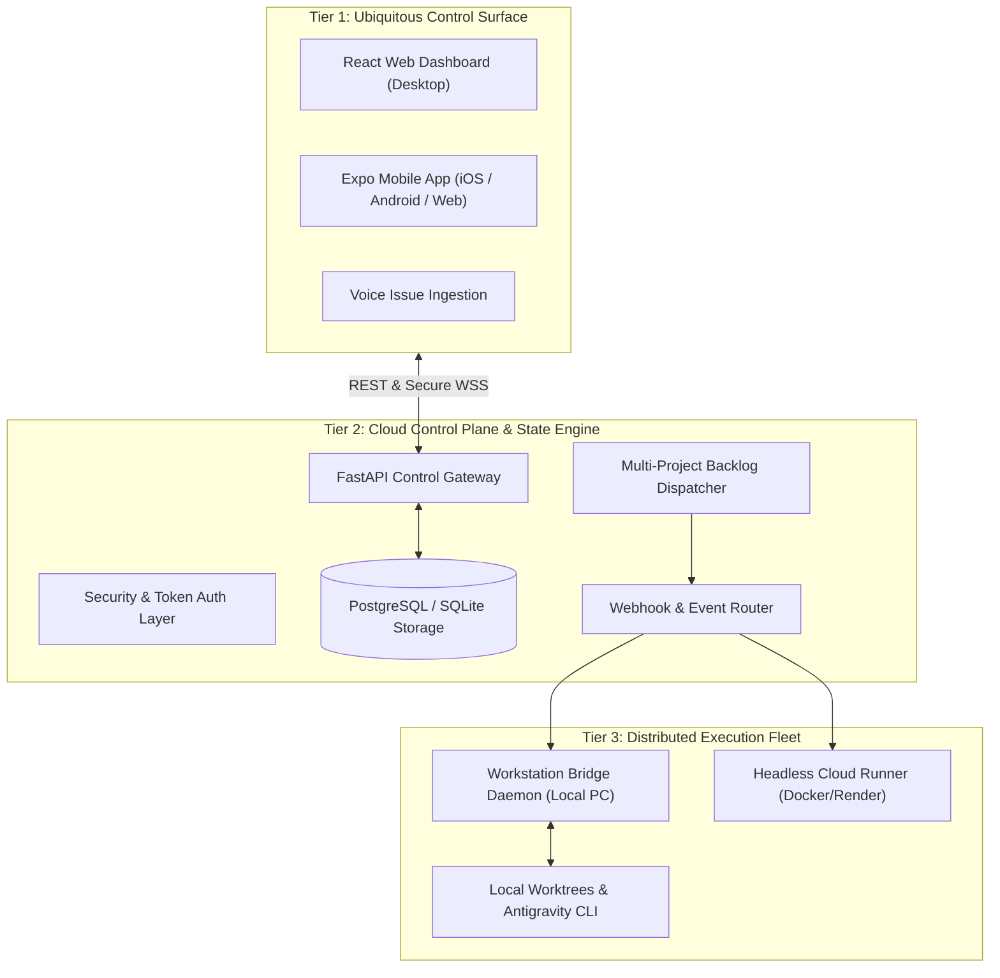

# 📜 The Agent Manager Manifesto
### The Operating System for Autonomous Software Engineering

> *"Software is no longer just written line by line at a desk; it is orchestrated, directed, and verified across autonomous agent swarms."*

---

## 🧭 Preamble & Mission

**Agent Manager** was born out of a fundamental shift in software engineering: the transition from conversational AI pair-programmers to **autonomous, persistent, multi-project engineering swarms**.

AI agents possess immense capability, but without governance, isolation, observability, and structured control, autonomous coding devolves into chaotic context pollution, runaway token spending, broken main branches, and untracked changes.

**The Mission of Agent Manager:**
To provide an industrial-grade **Control Plane, Governance Engine, and Execution Fabric** that transforms raw developer intent—whether typed in an issue, managed on a Kanban board, or spoken on mobile—into verified, production-ready pull requests across any number of software repositories, with zero blind trust and zero main-branch contamination.

---

## 🔍 The Empirical Journey: Lessons from Completed & Open Issues

The path forward for Agent Manager is directly anchored in the forensic evidence of every issue tackled, solved, and planned across the repository's history:

```
[Genesis: Local Scripts] 
   └──► [Phase 1: Total Observability & Transparency] (Issues #1, #5, #7, #12, #32, #33, #34, #42, #43, #65)
   └──► [Phase 2: Process Resilience & Decoupled Daemons] (Issues #2, #3, #8, #45, #51, #72, #73, #76)
   └──► [Phase 3: Multi-Project Swarm Concurrency] (Issues #30, #48, #55, #58, #77, #79, #80)
   └──► [Phase 4: Cloud Control Plane & Mobile Everywhere] (Issues #16, #18, #19, #20–#27, #85, #87, #88, #89)
   └──► [Phase 5: Cognitive Hygiene & Async Event Fabric] (Issues #39, #84, PR #86)
```

### 1. What Completed Issues Taught Us (The Hard-Won Truths)
- **Eliminating the Black Box (Issues #1, #5, #12, #32, #34, #43, #65):**
  Early agents felt opaque. We engineered live token streaming, collapsible thought/reasoning traces, tool execution cards with diff views, timescale telemetry, and unified issue links. *Lesson: A developer cannot trust what they cannot see.*
- **Severing the Agent from the Server (Issues #2, #3, #8, #73, #76):**
  Initially, stopping or reloading the web server terminated all active agent runs. We decoupled the execution layer into detached OS daemon processes (`agent_service.py`) with atomic disk persistence and auto-reattaching stream tailers. *Lesson: Agent lifecycles must be immortal and server-independent.*
- **The 3-Stage Cognitive Division of Labor (Issues #36, #40, #72):**
  Using a single prompt or single model tier to do everything led to shallow planning and blown token budgets. We partitioned workflows into:
  1. *Stage 1 (Fast/Dumb Model)*: Issue interpretation & acceptance criteria extraction.
  2. *Stage 2 (Reasoning/Pro Model)*: Architecture planning, modular decomposition, and file mapping.
  3. *Stage 3 (Worker Model)*: Focused execution, unit test verification, and git commits.
- **The Autonomous Backlog Pump (Issues #48, #58, #77, #80):**
  An idle agent is wasted throughput. We built the autonomous cron dispatcher to evaluate project boards per connected repository, guaranteeing that every active project maintains concurrent progress without blocking siblings.
- **Strict Anti-Monolith Directives (Issue #45, AGENTS.md):**
  LLMs lose attention and hallucinate when forced to edit giant files. We codified mandatory architectural rules: no new files >250 lines, slice reads with `grep_search`, and auto-decompose when refactoring legacy files.

### 2. What Uncompleted Issues Demand (The Active Frontier)
- **Ubiquitous Mobile & Remote Control (Issues #20–#24, PR #87):**
  Engineers are not tethered to their IDEs. The React Native / Expo application extends the control plane to smartphones, providing push alerts on milestones, live transcript inspection, and remote context injection.
- **Hybrid Cloud / Local Workstation Topology (Issues #16, #19, #27, #88, #89):**
  A central cloud control plane (FastAPI on Render) pairs with a lightweight Workstation Bridge Daemon, allowing cloud webhooks and mobile commands to command local desktop worktrees and hardware.
- **Persistent Relational Backing (Issue #18):**
  Graduating from flat JSON storage to SQLite and managed PostgreSQL for bulletproof session history, multi-tenancy, and audit logs.
- **Cognitive Anti-Loop & File Trap Guards (Issue #39):**
  Preventing agents from burning thousands of tokens reading massive generated files, enforcing strict repetition circuit breakers, and enforcing turn limits.

---

## 🏛️ The Eight Pillars of Agent Manager

Every design decision, pull request, and architectural enhancement in Agent Manager MUST honor these eight foundational pillars:

### I. Zero Blind Trust: Radical Observability
An autonomous agent must never be a silent black box. The operator has an absolute right to real-time visibility:
- **Streaming Thoughts**: Expose raw model reasoning before tool invocation.
- **Structured Tool Logs**: Capture inputs, outputs, errors, and precise file diffs.
- **Telemetry & Cost Transparency**: Track token consumption, turn counts, and timescale velocity live.

### II. Sacred Isolation: Zero Main-Branch Contamination
No autonomous agent is ever permitted to edit code directly in the primary workspace checkout:
- **Worktree Sandboxing**: Every issue or task executes in a dedicated Git worktree (`.worktrees/issue-<number>`).
- **Clean Blast Radius**: If an agent fails, halls, or exhausts its budget, the worktree can be destroyed in one click without leaving untracked files or corrupted git states.
- **Strict Merge Gateways**: Code enters `main` solely through verified Pull Requests that satisfy automated tests.

### III. Cognitive Hygiene & The Anti-Monolith Law
Context windows are finite and precious cognitive real estate:
- **The 250-Line Limit**: No new file should ever exceed 250 lines of code. Features must be decomposed into modular services, models, components, and utilities.
- **Targeted Slicing**: Never load entire files into memory; locate symbols via `grep_search` and inspect using line slices (max 100 lines).
- **Auto-Compaction**: Long terminal outputs, repetitive tool logs, and verbose intermediate thoughts must be compressed automatically upon task completion.

### IV. Process Immortality & Architectural Decoupling
The user interface, API server, and agent execution layers are strictly decoupled:
- Agents run as independent, detached processes.
- The web server and frontend can be refactored, restarted, or redeployed without aborting active runs.
- Stream listeners dynamically re-attach to running daemon logs without loss of state.

### V. Multi-Model Division of Cognitive Labor
Cognitive efficiency requires specialized models:
- **Summarizers**: Ingest raw issues, extract requirements, and formulate structured criteria rapidly.
- **Architects / Planners**: High-reasoning models that map modular file trees, enforce anti-monolith standards, and identify edge cases before writing a line of code.
- **Executors / Workers**: Disciplined implementation agents that write code, execute commands, run tests, and commit diffs.

### VI. The Autonomous Swarm Engine (Continuous Concurrency)
Software development is a continuous pipeline, not a one-off prompt:
- **Multi-Repo Backlog Pumping**: Autonomous evaluation cycles monitor multiple connected projects simultaneously.
- **Auto-Loop Dispatching**: As soon as an agent completes its task, the next ready item is claimed, isolated in a worktree, and started.
- **Board Synchronization**: Transitions from `📋 Ready for Agent` to `⚡ In Progress` to `🔍 In Review` occur programmatically with zero manual bookkeeping.

### VII. Ubiquitous Command & Human-in-the-Loop
Autonomy does not mean abandonment. The human operator is the ultimate engineering director:
- **Multi-Modal Ingestion**: Voice input (`🎙️ Voice Issue`) structures complex spoken ideas into actionable GitHub cards.
- **Cross-Platform Everywhere**: Native mobile apps (Expo iOS/Android) and desktop web interfaces provide parity of control.
- **Interactive Context Injection**: Operators can chime in via WebSocket chat to guide, redirect, pause, or unblock agents in real time.

### VIII. Deterministic Accountability & Changelog Fidelity
Every agent action must leave an indelible audit trail:
- **Automated Issue Notices**: Immediate takeover comments inform the team of branch, worktree, and planned approach.
- **Mandatory CHANGELOG.md**: No PR is complete without explicit entries documenting additions, changes, or fixes under standard keep-a-changelog headings.
- **Visual & Test Proof**: All deliverables must present test logs, build outcomes, and UI verification.

---

## 🏗️ The System Topology: The Triad



1. **The Control Surface (Tier 1)**: React frontend and Expo cross-platform apps delivering live streaming tokens, collapsible reasoning, diff cards, voice intake, and pause/resume buttons.
2. **The Control Plane (Tier 2)**: FastAPI web services, PostgreSQL session storage, GitHub webhook parsers, and cron dispatchers operating on Render.
3. **The Execution Fleet (Tier 3)**: A hybrid mesh of local Workstation Bridge Daemons (leveraging local hardware, private MCP servers, and Antigravity CLI) and cloud container runners for headless automation.

---

## 🗺️ The Path Forward: Strategic Roadmap

### Milestone 1: Cognitive Hygiene & Stale Worktree Pruning (Immediate Sprint)
- [ ] Decompose monolithic `issues.py` (344 LOC) into modular route controllers (#100).
- [ ] Implement long generated file suppressors and binary filters (#39).
- [ ] Implement autonomous stale worktree pruning and merge lifecycle manager (#101).
- [ ] Finalize CI/CD workflow for automated test runs on PRs (#25, PR #88).

### Milestone 2: Cloud Control Plane & Hardened Storage
- [x] Decouple agent processes from server lifecycle (#73).
- [x] Build modern React dashboard (#75).
- [ ] Migrate session and config storage to PostgreSQL/SQLite (#18).
- [ ] Implement JWT/API Token authentication for public control plane (#19).
- [ ] Deploy Dockerized backend with `render.yaml` infrastructure-as-code (#16).

### Milestone 3: Cross-Platform Mobile Command (Active)
- [x] Scaffold Expo app with TypeScript and Expo Router (#20, PR #87).
- [ ] Establish auto-reconnecting WebSocket client and live session feed (#21).
- [ ] Build mobile Live Transcript Viewer with collapsible reasoning (#22).
- [ ] Implement interactive context injection and remote pause/resume controls (#23).
- [ ] Add push notifications for milestone approvals and guardrail alerts (#24).

### Milestone 4: Hybrid Workstation Bridge & Async Architecture
- [ ] Develop the lightweight Workstation Bridge Daemon (#27).
- [ ] Implement secure outbound reverse tunneling so Render triggers local CLI runs.
- [ ] Transition from file-tailing to callback/webhook-driven async agent execution (#84, PR #86).

### Milestone 5: Portfolio-Wide Autonomous Swarm Governance
- [ ] Automated Multi-Agent Peer Review & Security Audit Gateway (#90).
- [ ] Ephemeral Preview Environments & Visual E2E Validation (#91).
- [ ] Cross-Repository Semantic Knowledge Graph & Shared Vector Memory (#92).
- [ ] Per-Repository Dollar Budgeting & Dynamic Token Arbitrage (#93).
- [ ] Cross-Repository Coordinated Tasks & Contract Sync (#94).
- [ ] Real-Time USD Cost Estimator & Session Execution Replay (#95).
- [ ] Autonomous Multi-Agent Worktree Rebase & Merge Conflict Resolver (#96).

### Milestone 6: Autonomous SRE & Continuous Maintenance
- [ ] Sentry / Datadog Autonomous Bug Ingestion, Reproduction & Self-Healing (#97).
- [ ] Autonomous SemVer Release Tagging & Package Publisher (#98).
- [ ] Autonomous CVE & Library Upgrade Engine / Dependabot++ (#99).

---

## 🤝 The Pledge

We believe that software engineering in the era of autonomous intelligence is not about replacing developers—it is about **supercharging them into commanders of high-performing engineering swarms**.

By upholding modular architecture, absolute isolation, total observability, and rigorous audit trails, Agent Manager ensures that autonomous development remains fast, transparent, cost-effective, and exceptionally reliable.

*This is our path. This is our manifesto.*
