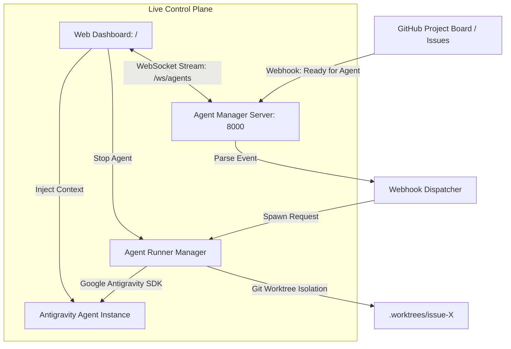

# 🚀 Agent Manager

> **Webhook Dispatcher, Live Dashboard & Interactive Control Plane for Google Antigravity Agents**

[](./MANIFESTO.md)

Agent Manager is an orchestration system built on the **Google Antigravity SDK** (`google-antigravity`). It turns GitHub issues and project board transitions into isolated, autonomous AI agent sessions while giving you real-time visibility, graceful stop controls, and live interactive context injection.

Read [**The Agent Manager Manifesto**](./MANIFESTO.md) to understand the design philosophy, hard-won lessons, 8 pillars, and long-term vision guiding this platform.

---

## 🌟 Key Features

- **🪝 GitHub Webhook Ingestion**: Listens for `issues.labeled` (e.g. `agent:ready`), project board status changes (`📋 Ready for Agent`), and issue comments.
- **⚡ Antigravity SDK Powered**: Spawns real-time `Agent` instances using `LocalAgentConfig` and `CapabilitiesConfig`.
- **🔀 Worktree Isolation**: Automatically sets up isolated Git worktrees (`.worktrees/issue-<number>`) so concurrent agents never corrupt branches or main workspace files.
- **🖥️ Live Web Dashboard**:
  - Live conversation transcript viewer with streaming tokens.
  - Collapsible **Thinking & Reasoning** trace panels.
  - Structured **Tool Execution** cards with input parameters and outcomes.
- **🛑 One-Click Stop**: Instantly halt runaway or stuck agents safely without orphan processes.
- **📦 Enhanced Token Management & Auto-Compaction**: Automatically condenses verbose tool execution logs, terminal outputs, and reasoning traces upon process/turn completion while preserving user instructions and final deliverables. Cuts context footprint, eliminates UI clutter, and includes manual compaction controls.
- **💬 Real-Time Context Injection**: Type new instructions, feedback, or clarifications and inject them directly into an active agent's live memory (`agent.chat()`) via WebSockets.
- **🧪 Built-in Simulation**: Test webhooks and launch ad-hoc agents directly from the UI without needing external tunnels during local development.

---

## 🏗️ Architecture



---

## 🚀 Quick Start

### 1. Prerequisites
- Python 3.10+
- Git 2.30+
- Google Antigravity SDK

### 2. Installation
```bash
# Clone the repository
git clone https://github.com/BowenMichael/agent-manager.git
cd agent-manager

# Install dependencies
pip install -r requirements.txt
```

### 3. Configuration
Copy `.env.example` to `.env` and configure your settings:
```bash
cp .env.example .env
```
```env
PORT=8000
HOST=0.0.0.0
GITHUB_PERSONAL_ACCESS_TOKEN=ghp_your_token
GITHUB_WEBHOOK_SECRET=your_optional_secret
WORKSPACE_BASE=e:/~Michael Bowen/Projects
DEFAULT_REPO=BowenMichael/f1-frontend
```

### 4. Launching the Manager
```bash
python main.py --port 8000
```
Visit **`http://localhost:8000`** in your browser to open the Agent Manager Control Plane!

---

## 🪝 Configuring GitHub Webhooks

1. Go to your GitHub repository (**Settings > Webhooks > Add webhook**).
2. Set **Payload URL** to:
   ```text
   http://<your-host-or-tunnel-url>:8000/api/webhooks/github
   ```
3. Set **Content type** to `application/json`.
4. Under **Which events would you like to trigger this webhook?**, select **Let me select individual events**:
   - ✅ **Issues** (when labeled `agent:ready` or opened)
   - ✅ **Issue comments** (injects user comments into active agents)
   - ✅ **Projects v2 item status** (when cards move to `Ready for Agent`)
5. Click **Add webhook**.

> **Tip for Local Testing**: If developing locally without a public domain, you can use `smee.io` or `ngrok`, or simply use the **"Simulate Webhook"** button in the dashboard!

---

## 📡 REST & WebSocket API Reference

| Endpoint | Method | Description |
| :--- | :--- | :--- |
| `/api/webhooks/github` | `POST` | Ingests incoming GitHub webhook payloads |
| `/api/webhooks/simulate` | `POST` | Simulates an issue/board webhook locally |
| `/api/agents` | `GET` | Lists all active and historical agent sessions |
| `/api/agents/{id}` | `GET` | Returns full session details and message transcript |
| `/api/agents/spawn` | `POST` | Spawns a new autonomous agent |
| `/api/agents/{id}/stop` | `POST` | Stops an active agent session immediately |
| `/api/agents/{id}/compact` | `POST` | Compacts and compresses verbose tool messages and thoughts |
| `/api/agents/{id}/context` | `POST` | Injects additional context into a running agent |
| `/ws/agents` | `WS` | Real-time bi-directional streaming WebSocket |

---

## 🗺️ Documentation & Operations

- 📖 [The Agent Manager Manifesto](MANIFESTO.md) — 8 Pillars, engineering lessons, and architecture charter.
- 📱 [Hosting, Expo & Feedback Flywheel Plan](docs/hosting_and_expo_plan.md) — Cloud deployment, Expo mobile client, and autonomous user feedback loop.
- 🔄 [Agent Lifecycle & Quick-Resume Guide](docs/agent_lifecycle_and_resume_guide.md) — Turnkey instructions for pausing, stopping, and instantly resuming agents in a new chat.

---

## 🧪 Running Tests
```bash
python -m unittest tests/test_manager.py
```

---

## 🛡️ License
Apache 2.0. Built with Google Antigravity.

