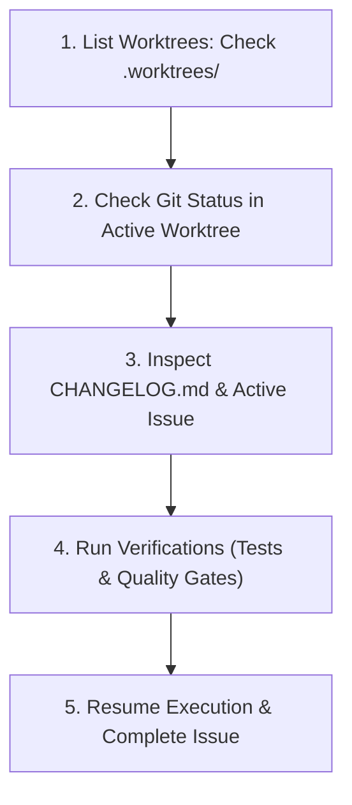

# Agent Lifecycle & Quick-Resume Guide

This operational guide provides step-by-step instructions for safely stopping, inspecting, and resuming the **Agent Manager** autonomous agents—enabling developers and incoming AI agents to pick up progress from a **brand-new chat** in under 30 seconds with zero context loss.

---

## 1. Quick-Start: Resuming from a New Chat

When opening a fresh chat in the Antigravity IDE, copy and paste this single prompt to resume work instantly:

```markdown
I am resuming work on agent-manager. Please follow the instructions in `docs/agent_lifecycle_and_resume_guide.md`:
1. Inspect `.worktrees/` to see if an issue worktree is in active development.
2. Check `git status` inside active worktrees and in the main repository checkout.
3. Inspect `CHANGELOG.md` under `[Unreleased]` for recent progress.
4. Run the test suite with log suppression (`cmd /c "python -m unittest tests/test_manifesto_metrics.py > test_run.log 2>&1"`).
5. State the active issue number, current completion status, and immediately resume execution.
```

---

## 2. Where State is Preserved

`agent-manager` is architected with strict persistence guarantees so that interrupting a session never destroys work:

| Layer | Location / Mechanism | What It Preserves |
|---|---|---|
| **Code Sandboxes** | `.worktrees/issue-<number>/` | Uncommitted code, staged changes, and isolated dependencies. |
| **Git Branches** | `feat/issue-<number>-<description>` | Incremental commits pushed or local to the worktree branch. |
| **Project Board** | GitHub Projects v2 (`BowenMichael`) | High-level status (`📋 Ready for Agent`, `⚡ In Progress`, `🔍 In Review`, `✅ Done`). |
| **Session History** | `data/agent_manager.db` / `agent_sessions.json` | Chat messages, tool execution logs, model reasoning traces, and token usage. |
| **Release Log** | `CHANGELOG.md` under `## [Unreleased]` | Human-readable audit of completed capabilities and issue references. |
| **Progress Engine** | `agent_manager/cron/progress_engine.py` | Queue priority, autonomous sweep history, and idle/active detector. |

---

## 3. How to Safely Stop or Pause the Agent

### Method A: Graceful Pause via UI or REST API
To pause an active agent while preserving all session state:
- **Web / Expo UI**: Click the **Pause** button on the active session card.
- **REST API**:
  ```bash
  curl -X POST http://localhost:8000/api/agents/<session-id>/pause
  ```
- **Behavior**: The runner halts after completing the current tool step, records a `PAUSED` status in the database, and leaves the worktree intact.

### Method B: Halting Background Tasks in IDE
If an autonomous command or background task is running inside the IDE:
1. List running tasks using the `manage_task(Action='list')` tool.
2. Terminate the task cleanly:
   ```json
   manage_task(Action="kill", TaskId="<conversation-id>/task-<id>")
   ```
3. All worktree edits on disk remain untouched.

### Method C: Hard Stop / Terminal Interrupt
If the FastAPI server or CLI was launched in a PowerShell terminal:
- Press `Ctrl + C` in the console window.
- The worktree `.worktrees/issue-<number>` retains all modified files.

---

## 4. Agent Resumption Checklist (For the Incoming Agent)

When an agent starts in a new chat, it must execute this 5-step checklist before making any new edits:



### Step 1: Discover Active Worktrees
```powershell
# List existing worktrees
git worktree list
```
- If `.worktrees/issue-<number>` exists, that issue is currently in progress.

### Step 2: Check Worktree Git Status
Always use output suppression per repository rules:
```powershell
cmd /c "git -C .worktrees/issue-<number> status > wt_status.log 2>&1"
```
Read the last lines if needed, then remove the log:
```powershell
cmd /c "del wt_status.log"
```

### Step 3: Inspect `CHANGELOG.md`
Check `CHANGELOG.md` under `## [Unreleased]` to identify recent achievements and see which issue numbers have already been documented.

### Step 4: Run Tests with Command Log Suppression
Ensure prior work passes tests before continuing:
```powershell
cmd /c "python -m unittest tests/test_manifesto_metrics.py tests/test_code_quality_metrics.py > test_run.log 2>&1"
```
- Exit code `0`: Success! Delete `test_run.log`.
- Non-zero: View the last 40 lines (`Get-Content -Tail 40 test_run.log`) to fix errors.

### Step 5: Resume Execution
- Complete the code changes within the worktree.
- Verify AST quality gates: No functions > 40 LOC, no files > 250 LOC.
- Commit, push branch, open Pull Request, and post completion comment to GitHub.

---

## 5. Restarting the Autonomous Progress Engine

The autonomous progress engine checks for idle runners and advances the next metric-driven task:

### Trigger Single Immediate Check
```powershell
python -m agent_manager.cron.progress_engine --now
```

### Run Continuous Daemon Loop (Background)
```powershell
python -m agent_manager.cron.progress_engine --daemon --interval 300
```

### Check Autonomous Status via API
```bash
curl http://localhost:8000/api/cron/progress-status
```

---

## 6. Worktree Cleanup & Troubleshooting

| Scenario | Resolution Command |
|---|---|
| **Task Completed & PR Merged** | `git worktree remove .worktrees/issue-<number>` |
| **Abandon / Reset Incomplete Worktree** | `git worktree remove --force .worktrees/issue-<number>` |
| **Branch Diverged from Main** | `git -C .worktrees/issue-<number> rebase origin/main` |
| **Port 8000 In Use on Restart** | `Get-Process python -ErrorAction SilentlyContinue \| Stop-Process` |
