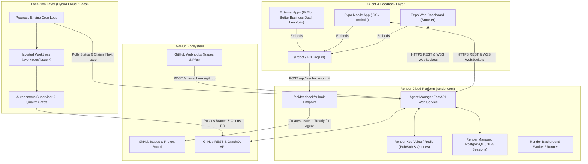

# Architecture & Hosting Plan: Cloud Deployment, Expo Mobile App & The Autonomous Feedback Flywheel

This document defines the comprehensive strategy, technical architecture, hosting topology, security model, and prioritized implementation roadmap for transitioning **Agent Manager** into an enterprise-grade cloud control plane accessible via Web, iOS, and Android (using Expo / React Native) on Render, anchored by a **Universal Feedback Flywheel** that turns real-world app usage into autonomous agent tasks.

---

## 1. Executive Summary & The Autonomous Flywheel Vision

### 1.1 The Ultimate Vision: A Self-Improving Multi-Repo Ecosystem
`agent-manager` is evolving beyond a local developer tool into the central nervous system for an entire portfolio of applications (**FitElo**, **Better Business Deal**, **Leanfolio**, **F1 Frontend**, and **Agent Manager** itself). 

To achieve true autonomy, development cannot exist in a vacuum. There must be an **instantaneous, closed-loop feedback flywheel**:
1. **Everywhere Access**: The developer can monitor agents, view live diffs, and inject prompts from their phone (iOS/Android via Expo) or browser while on the go.
2. **Everywhere Feedback**: When using or testing any deployed application (on web or mobile), finding a bug or wanting an enhancement shouldn't require manual issue filing or terminal access.
3. **Autonomous Ingestion**: A lightweight, drop-in `<AgentFeedbackWidget />` and universal `POST /api/feedback/submit` endpoint captures the bug report, user context, active route, screenshots, and logs, automatically turning them into structured GitHub Issues in `📋 Ready for Agent`.
4. **Autonomous Execution**: The background Progress Engine detects idle capacity, checks out an isolated worktree, implements the fix, verifies quality gates, and opens a Pull Request.
5. **Mobile Verification**: The developer receives a push notification on their phone with a link to an ephemeral preview build, reviews the change, and merges it.

```
       ┌────────────────────────────────────────────────────────┐
       │   Deployed Applications (Web & Mobile)                 │
       │   - Agent Manager Web / Expo Mobile                    │
       │   - FitElo, Better Business Deal, Leanfolio            │
       └──────────────────────────┬─────────────────────────────┘
                                  │ User taps feedback / bug report
                                  ▼
       ┌────────────────────────────────────────────────────────┐
       │   Universal Feedback Flywheel                          │
       │   - Drop-in <AgentFeedbackWidget />                    │
       │   - POST /api/feedback/submit API                      │
       │   - Captures logs, route, viewport, stack traces       │
       └──────────────────────────┬─────────────────────────────┘
                                  │ Formats & creates issue
                                  ▼
       ┌────────────────────────────────────────────────────────┐
       │   GitHub Project Board: '📋 Ready for Agent'          │
       └──────────────────────────┬─────────────────────────────┘
                                  │ Progress Engine detects idle agent
                                  ▼
       ┌────────────────────────────────────────────────────────┐
       │   Isolated Git Worktree (.worktrees/issue-<number>)    │
       │   - Agent Takeover Comment posted                      │
       │   - Autonomous implementation & AST quality gate       │
       │   - Pull Request opened + CHANGELOG updated            │
       └──────────────────────────┬─────────────────────────────┘
                                  │ Webhook triggers Preview Build
                                  ▼
       ┌────────────────────────────────────────────────────────┐
       │   Developer Notification & Mobile Review (Expo)        │
       │   - Push notification on phone                         │
       │   - Instant preview link & diff inspection             │
       │   - One-tap approval to merge to 'main'                │
       └────────────────────────────────────────────────────────┘
```

---

## 2. System Architecture & Component Topology



### 2.1 The Universal Feedback Ingestion API (`POST /api/feedback/submit`)
The feedback endpoint is designed as an open, secure API capable of receiving telemetry and feedback from any frontend client:
- **Payload Schema**:
  ```json
  {
    "app_name": "fitelo",
    "target_repo": "BowenMichael/fitelo",
    "feedback_type": "bug" | "feature" | "ux_polish",
    "title": "Workout timer pauses when switching tabs",
    "description": "When navigating between tabs during an active workout session, the countdown halts.",
    "route": "/workout/active?routine=hypertrophy",
    "user_agent": "Mozilla/5.0 (iPhone; CPU iPhone OS 17_4 ...)",
    "viewport": {"width": 390, "height": 844},
    "console_logs": [
      {"level": "error", "message": "Worker thread throttled in background", "timestamp": "2026-10-05T19:20:00Z"}
    ],
    "screenshot_base64": "data:image/png;base64,...",
    "user_email": "user@example.com"
  }
  ```
- **Processing Logic**:
  1. Validates application API key or public feedback token.
  2. Synthesizes a structured markdown issue body with diagnostic collapsible sections (`<details><summary>Diagnostics</summary>...</details>`).
  3. Uses GitHub API to create an issue on `target_repo` (or `agent-manager` as root orchestrator).
  4. Automatically positions the new issue into the GitHub Project Board column **`📋 Ready for Agent`**.
  5. Broadcasts the incoming task over WebSocket to connected Expo clients.

### 2.2 The Drop-In `<AgentFeedbackWidget />` Component
A single React / React Native component distributed via `@agent-manager/feedback-widget` or copied as a zero-dependency snippet:
- Floating, non-intrusive pill button (bottom corner) with quick toggle.
- Built-in screen capture / screenshot preview via `html2canvas` or `react-native-view-shot`.
- Automatic log buffer capture (intercepts last 20 console messages).
- Audio voice note transcription option using the existing `VoiceIssueModal` speech service.

### 2.3 Cloud Hosting on Render
- **FastAPI Web Service**: Multi-stage Linux Docker container running Uvicorn. Exposes REST endpoints, feedback submission, and WebSocket feeds.
- **Render PostgreSQL**: Replaces ephemeral JSON files (`agent_sessions.json`) with ACID-compliant relational storage for sessions, messages, and cross-repo telemetry.
- **Render Background Worker**: Executes scheduled cron sweeps (`Progress Engine`) and orchestrates headless tasks.

### 2.4 Mobile & Web Control Plane on Expo (React Native & Web)
- Built with **Expo SDK 51+** with TypeScript and Expo Router.
- **Everywhere Usability**:
  - Live session monitor with WebSocket auto-reconnect.
  - Collapsible reasoning, thinking traces, and file diff viewer.
  - Interactive context injection (reply directly to agents from phone).
  - Push notifications via Expo Notifications (e.g., when an agent opens a PR, hits a pause guardrail, or needs human review).

---

## 3. Prioritized Implementation Roadmap

We organize implementation into 4 sequential phases. **Phase 1 (The Feedback Flywheel & Backend Cloud Base) is elevated to top priority** so that active development across all apps immediately feeds back into the autonomous agent loop.

```
┌──────────────────────────────────────────────────────────────────────────┐
│ PRIORITY 1: The Autonomous Feedback Flywheel & Cloud Ingestion          │
│ 1. Universal Feedback Submission API (POST /api/feedback/submit)         │
│ 2. Drop-in <AgentFeedbackWidget /> React/RN Component                    │
│ 3. Automated Issue & Project Board Placement ('Ready for Agent')         │
│ 4. Backend Containerization & render.yaml Blueprint                      │
└────────────────────────────────────┬─────────────────────────────────────┘
                                     │
┌────────────────────────────────────▼─────────────────────────────────────┐
│ PRIORITY 2: Expo Cross-Platform Mobile & Web Client                      │
│ 1. Scaffold Expo SDK 51+ Client (iOS / Android / Web)                    │
│ 2. Real-Time WebSocket Session Stream & Diff Viewer                      │
│ 3. Interactive Context Injection & One-Tap Controls                      │
│ 4. Push Notifications for Review & Verification Milestones               │
└────────────────────────────────────┬─────────────────────────────────────┘
                                     │
┌────────────────────────────────────▼─────────────────────────────────────┐
│ PRIORITY 3: Enterprise Cloud Persistence & Security                      │
│ 1. PostgreSQL Relational Store Migration (SQLAlchemy/SQLModel)           │
│ 2. JWT & API Key Authentication Gateway                                  │
│ 3. Cross-Platform Filesystem & Worktree Abstractions                     │
└────────────────────────────────────┬─────────────────────────────────────┘
                                     │
┌────────────────────────────────────▼─────────────────────────────────────┐
│ PRIORITY 4: Autonomous Production Operations & Ephemeral Previews       │
│ 1. Render Background Worker & Progress Engine Cron Service               │
│ 2. Ephemeral Preview Environments per PR                                 │
│ 3. CI/CD Automated Pipelines with EAS Build                              │
└──────────────────────────────────────────────────────────────────────────┘
```

---

## 4. Itemized GitHub Issue Queue (In Order of Priority)

### Epic 1: The Autonomous Feedback Flywheel (PRIORITY 1 - IMMEDIATE)
- **Issue #102: [FLYWHEEL] Universal Feedback Ingestion API & Project Board Auto-Placement**
  - *Status*: Created on GitHub (#102).
  - *Description*: Implement `POST /api/feedback/submit` in FastAPI. Ingest feedback, capture device/route telemetry, format GitHub Issue with diagnostic metadata, and add directly to GitHub Project Board column `📋 Ready for Agent`.
  - *Acceptance Criteria*:
    - Validates incoming feedback payload with Pydantic model `FeedbackSubmissionRequest`.
    - Creates GitHub Issue with rich markdown formatting and diagnostic collapsible blocks.
    - Updates Project Board column to `📋 Ready for Agent`.
    - Unit tests covering submission validation, GitHub API mocking, and error handling.

- **Issue #103: [FLYWHEEL] Reusable `<AgentFeedbackWidget />` Component for Web & Mobile**
  - *Description*: Create a zero-dependency React and React Native feedback button and modal component. Embeddable into Agent Manager, FitElo, Better Business Deal, Leanfolio, and F1 Frontend.
  - *Acceptance Criteria*:
    - Floating trigger pill with smooth open/close animations.
    - Fields: Issue title, description, feedback type (Bug, Feature, Polish), and severity.
    - Auto-captures: Current route URL, viewport dimensions, user-agent, and recent console errors.
    - Optional screenshot / file attachment.
    - Submits to configured `POST /api/feedback/submit` with success toast confirmation.

- **Issue #16: [INFRA] Dockerize Agent Manager Backend and Add `render.yaml` Blueprint**
  - *Description*: Create production-ready multi-stage `Dockerfile` and `render.yaml` declaring the FastAPI Web Service, environment configurations, and health check endpoints.
  - *Acceptance Criteria*:
    - Docker container boots FastAPI with Uvicorn on port 8000 (configurable via `$PORT`).
    - Multi-stage build minimizes image size.
    - `/healthz` endpoint responds 200 OK.
    - `render.yaml` specifies build commands, start commands, and environment variables.

---

### Epic 2: Expo Cross-Platform Mobile & Web Client (PRIORITY 2)
- **Issue #20: [EXPO] Scaffold Cross-Platform Expo Application (iOS, Android, Web)**
  - *Description*: Initialize the cross-platform application in `/apps/mobile` or client workspace using Expo SDK 51+, Expo Router, and responsive design for Web and Mobile.
  - *Acceptance Criteria*:
    - Runs on Web (`npx expo start --web`), iOS Simulator, and Android Emulator.
    - Dark-mode aesthetic matching Agent Manager's design language.
    - Core navigation: Session Monitor, Flywheel Feedback Inbox, and Settings.

- **Issue #104: [EXPO] Real-Time Session Feed & Collapsible Reasoning Viewer**
  - *Description*: Build WebSocket client with automatic exponential backoff reconnection. Render live stream with collapsible thinking traces, token metrics, and tool execution diffs.
  - *Acceptance Criteria*:
    - Live feed updates instantly when agent sessions are created or updated.
    - Thinking/reasoning traces collapsible to keep mobile view clean.
    - Visual indicators for agent status (Running, Paused, In Review, Completed).

- **Issue #105: [EXPO] Remote Prompt Injection & One-Tap Agent Controls**
  - *Description*: Enable user to guide active agents from mobile phone: send context/guidance via `/api/agents/{id}/context`, pause, resume, or trigger progress engine.
  - *Acceptance Criteria*:
    - Responsive chat input bar with instant submission.
    - One-tap Stop, Resume, and Model/Effort toggles.
    - Confirmation modals for destructive actions.

- **Issue #106: [EXPO] Push Notifications for PR Readiness & Review Milestones**
  - *Description*: Integrate Expo Push Notifications to alert the user when an agent completes a task, requires review, or pauses due to budget guardrails.
  - *Acceptance Criteria*:
    - Device token registration endpoint `/api/notifications/register`.
    - Push notification sent on `AgentStatus.IN_REVIEW` or `AgentStatus.PAUSED`.
    - Tapping notification deep-links directly to the relevant session in the Expo app.

---

### Epic 3: Enterprise Persistence & Security (PRIORITY 3)
- **Issue #18: [DATA] Migrate Session Storage from Flat JSON to Managed PostgreSQL**
  - *Description*: Replace disk-bound JSON file serialization with a persistent relational database layer using SQLAlchemy/SQLModel and Alembic migrations.
  - *Acceptance Criteria*:
    - Database schema for `AgentSession`, `ConversationMessage`, `TaskCheckpoint`, and `FeedbackSubmission`.
    - Automated migrations on startup.
    - Seamless backward compatibility with existing REST and WebSocket contracts.

- **Issue #19: [SECURITY] Implement Authentication & Secure API Tokens for Control Plane**
  - *Description*: Secure REST endpoints and WebSocket channels with JWT bearer tokens or API key authentication to safely expose the backend on Render.
  - *Acceptance Criteria*:
    - Unauthenticated requests to `/api/agents` and `/ws/agents` receive 401 Unauthorized.
    - Configurable admin API key or GitHub OAuth integration.
    - Webhook ingestion remains verified via GitHub HMAC signature (`X-Hub-Signature-256`).

- **Issue #17: [BACKEND] Abstract Filesystem & Decouple Local Windows Path Dependencies**
  - *Description*: Refactor path resolution to support cross-platform execution (Linux containers on Render and Windows workstations).
  - *Acceptance Criteria*:
    - All path handling uses `pathlib.Path` with cross-platform fallback.
    - Windows-specific commands (`powershell ...`) are gated behind OS checks.
    - Worktree setup operates safely on Linux containers or headless servers.

---

### Epic 4: Ephemeral Previews & Operations (PRIORITY 4)
- **Issue #91: [PREVIEW] Ephemeral Preview Environments per Feature PR**
  - *Description*: Spin up automated web previews on Render / Vercel whenever an agent opens a PR, enabling instant mobile verification before merge.
- **Issue #107: [DEVOPS] GitHub Actions CI/CD Pipeline for Render & Expo EAS**
  - *Description*: Automate test suite execution, container builds, Render deployment triggers, and Expo EAS builds on merge to `main`.
