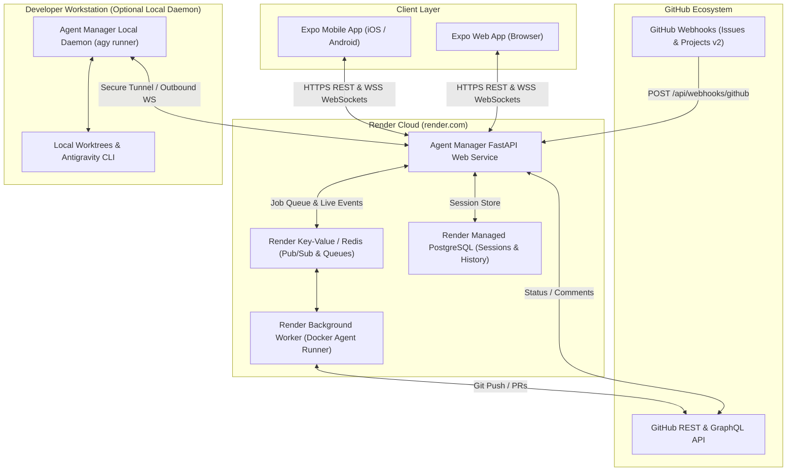

# Architecture & Hosting Plan: Cloud Deployment & Cross-Platform Expo App

This document outlines the end-to-end strategy, technical architecture, hosting topology, security model, and breakdown of actionable GitHub issues for transitioning **Agent Manager** from a purely local desktop/workstation setup into a hosted cloud control plane accessible via Web, iOS, and Android (using Expo / React Native) and Render.

---

## 1. Executive Summary & Challenges Analysis

### 1.1 The Current State
Currently, `agent-manager`:
- Runs locally as a FastAPI server on `localhost:8000`.
- Directly executes the local CLI binary `agy.exe` (`C:\Users\tv\AppData\Local\agy\bin\agy.exe`) in either desktop PowerShell windows (`powershell -NoExit -Command ...`) or child subprocess pipes with `--output-format stream-json`.
- Manipulates local disk paths (e.g. `e:/~Michael Bowen/Projects/...`) and creates local Git worktrees (`.worktrees/issue-<number>`).
- Relies on Google Antigravity subscription credentials bound to the local desktop environment or local MCP config.

### 1.2 The Cloud & Mobile Challenge
When hosting on a cloud container platform like **Render**:
1. **Runner Execution Context**: Render containers run Linux, have ephemeral disk storage (unless attached to persistent disks), and do not run Windows desktop GUI/PowerShell. Furthermore, running code edits and local builds requires a Git workspace, compiler toolchains, and AI agent execution environment.
2. **Mobile App (Expo / React Native)**: A mobile app cannot run Git or Python agent runtimes locally on a smartphone; it acts as a **rich, responsive, real-time control plane client** consuming the backend REST and WebSocket APIs.
3. **Connectivity & Security**: Hosting the control plane on Render exposes webhook endpoints and dashboard APIs to the public internet, requiring robust authentication (JWT/OAuth), secure WebSocket authorization, and secret management.

---

## 2. Proposed System Architecture

We adopt a **Decoupled Architecture with Hybrid Agent Execution Capabilities**:

### 2.1 Backend on Render
- **FastAPI Web Service**:
  - Hosted on Render Web Service (Python/Docker).
  - Handles incoming GitHub webhooks (`/api/webhooks/github`), user authentication (`/api/auth/*`), session management (`/api/agents/*`), and WebSocket streaming (`/ws/agents`).
  - Connects to a managed database (PostgreSQL on Render or Supabase) to persist session history, transcripts, and settings across redeployments.
- **Render Background Worker**:
  - For headless tasks or cloud-driven repository operations (cloning repos into ephemeral containers or Docker-in-Docker runners).
  - Uses Redis (`render-redis`) for Celery or RQ task dispatching.

### 2.2 Client App on Expo (React Native & Web)
- Built with **Expo (SDK 51+)** using TypeScript.
- **Single Cross-Platform Codebase**:
  - Web: Deployed via Render Static Site, Vercel, or Netlify.
  - Mobile: Distributed via Expo Application Services (EAS Build) for iOS TestFlight/App Store and Android APK/Google Play.
- **Features**:
  - Live session monitor with WebSocket auto-reconnect and state synchronization.
  - Collapsible Thought & Reasoning inspector.
  - Real-time tool execution logs with diff views.
  - Interactive context injection (send guidance, clarify questions).
  - One-tap Stop, Resume, and Model/Effort parameter switches.
  - Push notifications via Expo Notifications (e.g. agent needs review, agent completed, token limit warning).

### 2.3 Hybrid Runner Strategy (Cloud vs. Local Workstation)
To preserve the power of local Antigravity tools and private workstation worktrees while enabling remote mobile control:
- **Mode A (Full Cloud)**: Headless Git operations in Render containers using GitHub Personal Access Tokens and remote branch creation.
- **Mode B (Hybrid Control Plane)**: Render hosts the public webhook receiver, database, and Expo API. A lightweight local client daemon on the developer's PC maintains a secure outbound WebSocket connection to Render, picking up assigned jobs, running local `agy` in worktrees, and streaming events back to the cloud.

---

## 3. Phased Implementation Roadmap

### Phase 1: API Modernization & Production Readiness
1. Decouple hardcoded Windows paths (`e:/~Michael Bowen/...`, Windows executable paths) into configurable environment variables and abstract file-system adapters.
2. Replace JSON file storage (`agent_sessions.json`) with a persistent database (PostgreSQL with SQLAlchemy/SQLModel).
3. Introduce authentication (API Keys, JWT, and GitHub OAuth) to protect the control plane on public hosting.

### Phase 2: Render Infrastructure Setup
1. Create `render.yaml` (Infrastructure-as-Code Blueprint) declaring the Web Service, Redis, and Postgres database.
2. Build a production-ready `Dockerfile` multi-stage build.
3. Configure health checks (`/healthz`), zero-downtime deploys, and automated environment variable management.

### Phase 3: Expo Cross-Platform App Development
1. Initialize the Expo app (`apps/mobile` or dedicated repository) with TypeScript, Expo Router, and Tailwind (NativeWind) or Tamagui.
2. Build core screen flows:
   - Dashboard & Session Feed (Active, In Review, Completed, Paused).
   - Live Session Detail with Token Counter, Reasoning Inspector, and Tool Diffs.
   - Interactive Prompt / Context Injection Bar.
   - Settings & Model Configuration (Gemini 3.8 Flash, Claude Sonnet, Effort levels).
3. Implement resilient WebSocket client with automatic exponential backoff reconnection.
4. Set up Expo Push Notifications for task milestones.

### Phase 4: Hybrid Agent Runner & Worktree Bridge
1. Build an authenticated worker agent daemon capable of running on developer workstations to execute tasks requiring local tools, while syncing telemetry live to the cloud.
2. Implement cloud-based runner mode using GitHub API and temporary Git checkouts for cloud-only execution.

---

## 4. Itemized GitHub Issue Breakdown for Review

The following issues are prepared for creation on GitHub to track this initiative systematically:

### Epic 1: Backend Containerization & Cloud Infrastructure
- **Issue 1.1: [INFRA]: Dockerize Agent Manager Backend and Add `render.yaml` Blueprint**
  - *Description*: Create optimized multi-stage `Dockerfile` and `render.yaml` blueprint defining the Web Service, environment configurations, and health check endpoints.
  - *Acceptance Criteria*:
    - Docker container builds and boots FastAPI with Uvicorn.
    - `render.yaml` specifies build commands, start commands, and environment variable schema.
    - `/healthz` endpoint responds 200 OK.

- **Issue 1.2: [BACKEND]: Abstract Filesystem & Decouple Local Windows Path Dependencies**
  - *Description*: Refactor `agent_manager/config.py` and `agent_manager/runner.py` to support cross-platform path resolution, Linux environments, and pluggable workspace providers.
  - *Acceptance Criteria*:
    - All path handling uses `pathlib.Path` with cross-platform fallback.
    - Windows-specific commands (`start powershell ...`) are gated behind OS checks.
    - Worktree setup operates safely on Linux containers or headless servers.

- **Issue 1.3: [DATA]: Migrate Session Storage from Flat JSON File to PostgreSQL / SQLite**
  - *Description*: Implement a persistent database layer using SQLAlchemy or SQLModel to store `AgentSessionInfo` and `ConversationMessage` records, replacing disk-bound JSON file serialization.
  - *Acceptance Criteria*:
    - Database migrations with Alembic.
    - Session and message records persist across server restarts and multiple container instances.
    - Maintains backward compatibility with existing REST and WebSocket contracts.

- **Issue 1.4: [SECURITY]: Implement Authentication & Secure API Tokens for Control Plane**
  - *Description*: Secure REST endpoints and WebSocket channels with JWT bearer tokens or API key authentication to safely expose the backend on Render.
  - *Acceptance Criteria*:
    - Unauthenticated requests to `/api/agents` and `/ws/agents` receive 401 Unauthorized.
    - Configurable admin API key or GitHub OAuth integration.
    - Webhook ingestion remains verified via GitHub HMAC signature (`X-Hub-Signature-256`).

---

### Epic 2: Expo Cross-Platform Client (Web, iOS, Android)
- **Issue 2.1: [EXPO]: Scaffold Expo Application with TypeScript and Expo Router**
  - *Description*: Initialize the cross-platform application in `/apps/mobile` or client workspace using Expo SDK 51+, Expo Router, and responsive design for Web and Mobile.
  - *Acceptance Criteria*:
    - Runs on Web (`npx expo start --web`), iOS Simulator, and Android Emulator.
    - Clean theme matching the dark-mode dashboard styling of Agent Manager.
    - Base navigation: Sessions List, Session Detail, and Settings.

- **Issue 2.2: [EXPO]: Implement Real-Time Session Feed & WebSocket Client**
  - *Description*: Build state management (Zustand or React Query) integrating with the backend `/ws/agents` WebSocket for live status updates, token counts, and session state.
  - *Acceptance Criteria*:
    - Live feed updates instantly when agent sessions are created or updated.
    - Automatic reconnection handling when network fluctuates or mobile app is backgrounded.
    - Visual indicators for agent status (Running, Paused, In Review, Completed).

- **Issue 2.3: [EXPO]: Build Live Transcript Viewer with Collapsible Reasoning & Tool Cards**
  - *Description*: Port the web dashboard's rich message stream to React Native components, featuring collapsible thinking traces, token metrics, and formatted markdown rendering.
  - *Acceptance Criteria*:
    - Message roles rendered distinctly (User, Assistant, System, Tool Call).
    - Collapsible section for model thinking and reasoning tokens.
    - Markdown rendering for code snippets and architecture plans.

- **Issue 2.4: [EXPO]: Implement Interactive Context Injection & Control Actions**
  - *Description*: Provide interactive controls allowing the user to inject instructions into active agents, trigger One-Click Stop, restart, or resume paused sessions from their phone.
  - *Acceptance Criteria*:
    - Chat input bar with instant submission via `/api/agents/{id}/context`.
    - Stop / Resume / Restart buttons with confirmation dialogs.
    - Model & effort level selector for subsequent turns.

- **Issue 2.5: [EXPO]: Add Push Notifications for Task Milestones & Guardrail Alerts**
  - *Description*: Integrate Expo Push Notifications to alert the user when an agent completes a task, requires review, or pauses due to token/complexity limits.
  - *Acceptance Criteria*:
    - Device registration endpoint `/api/notifications/register`.
    - Push notification sent on `AgentStatus.IN_REVIEW` or `AgentStatus.PAUSED`.

---

### Epic 3: Deployment, CI/CD & Verification
- **Issue 3.1: [DEVOPS]: Setup GitHub Actions CI/CD for Render & Expo EAS**
  - *Description*: Automate testing, Docker image building, Render deployment triggers, and Expo EAS Web/Mobile builds on pull request merges.
  - *Acceptance Criteria*:
    - Automated tests run on PR.
    - Render deploys automatically on push to `main`.
    - EAS Preview builds trigger for mobile changes.

- **Issue 3.2: [DOCS]: Comprehensive Deployment & Operations Guide**
  - *Description*: Author detailed documentation explaining Render setup, environment variable configuration, custom domain mapping, and mobile app setup.
  - *Acceptance Criteria*:
    - Step-by-step setup guide in `docs/deployment.md`.
    - Troubleshooting guide for WebSockets behind proxies and Render sleep timeouts.
